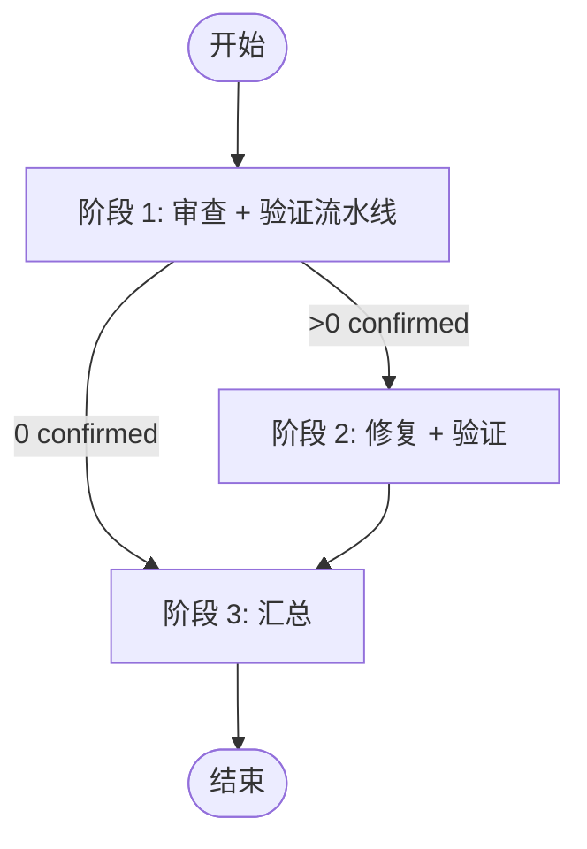

# Code Review - 3 Reviewer + Evidence Verification

这个 skill 直接承接 Droid 内置 `/review`，不要依赖中间转发 alias。

Dependency: this skill depends on the `hive` skill. Your first action after entering this skill MUST be to load the `hive` skill (use the Skill tool with skill="hive"). Do nothing else before loading hive.

你在 Hive runtime 中执行 Orchestrator 角色，编排一个线性 5 阶段 code review workflow。

MANDATORY:

1. 不要退化成普通单 agent review。
2. 如果 `hive current` 返回 `team: null` 且存在 tmux session，必须立即执行 `hive init`，然后再执行 `hive team`。
3. 在完成 `hive init` / `hive team` / reviewer `spawn` 之前，不要运行 `git diff`、`git diff --cached`、`git status -s`、`gh pr diff`，也不要直接输出 review findings。
4. `git diff` / `git status` 这些命令属于 reviewer 执行 request 时的工作，不是 orchestrator 在 bootstrap 阶段的工作。

## 0. 触发场景

当当前请求的语义接近下面这些内置 review prompt 时使用：

1. `Review the code changes against the base branch '<base>' ... Provide prioritized, actionable findings.`
2. `Review the current code changes (staged, unstaged, and untracked files) and provide prioritized findings.`
3. `Review the code changes introduced by commit <hash> ("<message>"). Provide prioritized, actionable findings.`
4. 用户给出自定义 review 指令，并希望按指定关注点审查改动

如果当前上下文已经明确给出了审查范围、base branch、commit、range 或自定义要求，就直接沿用这些信息生成 request artifact，不要先退化成泛泛的代码阅读。

## 1. 启动检测

优先顺序：

1. 先执行 `hive current`
2. 若已有 `team/workspace/agent`，继续用 Hive 命令
3. 若没有 team 但在 tmux 中，执行 `hive init`
4. 然后执行 `hive team`

始终以 `hive current` 的输出为准绳。

如果 `hive current` 的结果类似：

```json
{
  "team": null,
  "tmux": { "session": "...", "window": "...", "paneCount": 2 },
  "hint": "No team bound. Run `hive init` to create one from this tmux window."
}
```

那么下一步必须是：

```bash
hive init
hive team
```

不要在这两步之前执行任何 git diff / git status。

## 2. Review 模式

支持四种 review 模式。Orchestrator 在 request artifact 里必须明确写出模式与 diff 命令：

1. **PR / base branch compare**
   - `git -C <repo> diff <base>...<branch>`
   - 若已有 PR 号且 `gh` 可用，可用 `gh pr diff <number>`
2. **Working directory**
   - `git -C <repo> diff` + `git -C <repo> diff --cached` + `git -C <repo> status -s`
3. **Commit / range**
   - `git -C <repo> show <commit>` 或 `git -C <repo> diff <from>..<to>`
4. **Custom instructions**
   - 沿用用户或内置 `/review` 给出的审查要求

## 3. 架构

流水线设计：reviewer 完成后立刻 kill 并 spawn verifier，review 和 verification 并行。

```
Orch (lead pane) — 纯编排
├── S1: spawn 3 reviewer → 谁先完成谁先 kill + spawn verifier → 等全部 verifier → 去重
├── S2: spawn 1 fixer + 1 checker → 修复验证循环 → kill
└── S3: summary
```

| Agent | 建议模型 |
| ---- | ---- |
| reviewer-a | `custom:Claude-Opus-4.6-0` |
| reviewer-b | `custom:GPT-5.4-1` |
| reviewer-c | `custom:Claude-Opus-4.6-0` |
| verifier-a/b/c | 与对应 reviewer 不同模型 |
| fixer | `custom:Claude-Opus-4.6-0` |
| checker | `custom:GPT-5.4-1` |

## 4. 流程总览



### 阶段执行

**每个阶段执行前，必须先读取对应的 `stages/` 文件获取详细指令。**

| 阶段 | Orch 读取 | Agent 读取 |
| ---- | --------- | ---------- |
| 1 | `1-pipeline-orch.md` | `1-review-reviewer.md` / `1-verify-verifier.md` |
| 2 | `2-fix-orch.md` | `2-fix-verify.md` |
| 3 | `3-summary-orch.md` | (无 agent) |

## 5. Finding 格式（Evidence 要求）

每个 reviewer 的 finding 必须包含以下 4 项，缺任一项则被 S2 丢弃：

```markdown
1. [P?] 标题
   - File: path/to/file.py:42
   - Code: `从源文件原文引用的代码片段`
   - Why: 为什么这是问题
   - Verify: `可在 shell 中直接执行的验证命令`
```

这个格式是对抗 LLM 幻觉的核心机制：
- `File` + `Code` 确保 finding 指向真实存在的代码
- `Verify` 提供可机器执行的验证手段
- S3 的 verifier 会逐项检查这三项是否成立

## 6. 通信架构

```mermaid
flowchart TB
    Orch[Orchestrator]
    S1A[Reviewer A] & S1B[Reviewer B] & S1C[Reviewer C]
    S3A[Verifier A] & S3B[Verifier B] & S3C[Verifier C]
    S4F[Fixer] & S4V[Checker]

    Orch -->|spawn + send task| S1A & S1B & S1C
    S1A & S1B & S1C -->|hive send orch "done"| Orch
    Orch -->|spawn + send task| S3A & S3B & S3C
    S3A & S3B & S3C -->|hive send orch "done"| Orch
    Orch -->|spawn + send task| S4F & S4V
    S4F & S4V -->|hive send orch "done"| Orch

    Workspace[(workspace/artifacts)]
    Orch --> Workspace
```

- **消息驱动**：Orch → Agent（`hive send`），Agent → Orch（`hive send orch`）
- Orch 发完任务后 idle；agent 完成后主动 `hive send orch` 通知
- 多行内容先写 artifact，再用 `hive send ... --artifact <path>` 发送
- Agent 之间不直接通信，所有协调由 Orch 完成
- 不使用 `status-set` / `wait-status` 做同步

## 7. Orchestrator 行为规范

**角色：纯编排者，消息驱动**

- 启动流程，分配任务，发完后 idle
- 收到 agent 的 `hive send orch` 消息后被唤醒，处理后再 idle
- S1 做 findings 格式校验 + verifier 管理
- S2 做修复验证循环
- S3 做最终汇总

**边界：**

- 全程不审 diff、不出 findings
- reviewer/verifier artifact 只有他们自己写
- 每个阶段结束 kill agent pane，下个阶段重新 spawn
- 不使用 `hive wait-status`，不轮询

## 8. Request 契约

阶段 1 发给 reviewer 的 request 至少要写清：

- Mode
- Repo Path
- Subject
- Diff Commands
- Output Artifact
- Done Command（`hive send orch "review done reviewer=... verdict=... artifact=..."`)
- （PR 模式可选）PR Number / Base / Branch
- （Fix 阶段可选）Validator Commands

## 9. CLI 命令

| 命令 | 用途 |
| ---- | ---- |
| `hive current` | 查看当前 Hive 上下文 |
| `hive team` | 查看团队成员 |
| `hive init` | 初始化 team |
| `hive spawn <agent>` | 启动 agent pane |
| `hive send <agent> <msg>` | 发任务 / 回传完成通知 |
| `hive kill <agent>` | kill agent pane 并移除 |
| `hive layout <preset>` | 调整 tmux 布局（main-vertical / tiled 等） |

## 10. Workspace Keys

```plain
review-mode
review-subject
review-base
review-branch
review-commit
review-range
review-repo-path
review-pr
confirmed-count
s2-round
review-summary-artifact
```
