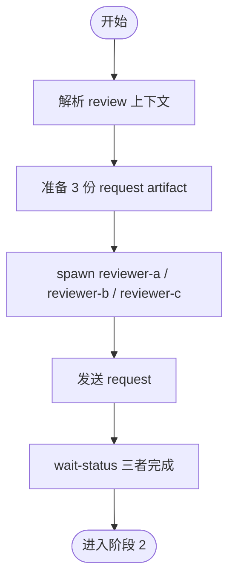

# 阶段 1: 分发审查任务 - Orchestrator

## 概述

Spawn 三个独立 reviewer 并行审查同一组变更。



## 执行

```bash
CTX_JSON=$(hive current)
WORKSPACE=$(printf '%s' "$CTX_JSON" | python3 -c 'import json,sys; print(json.load(sys.stdin).get("workspace",""))')

mkdir -p "$WORKSPACE/artifacts" "$WORKSPACE/state"

# 记录 review 上下文
printf '%s' 'pr' > "$WORKSPACE/state/review-mode"
printf '%s' '/absolute/path/to/repo' > "$WORKSPACE/state/review-repo-path"
printf '%s' 'PR #123' > "$WORKSPACE/state/review-subject"
printf '%s' 'main' > "$WORKSPACE/state/review-base"
printf '%s' 'feature-branch' > "$WORKSPACE/state/review-branch"
printf '%s' '123' > "$WORKSPACE/state/review-pr"

# 生成 3 份 request artifact（内容相同，output artifact 路径不同）
for reviewer in reviewer-a reviewer-b reviewer-c; do
  out="$WORKSPACE/artifacts/${reviewer}-r1.md"
  req="$WORKSPACE/artifacts/${reviewer}-request.md"
  cat > "$req" <<EOF
Mode: pr
Repo Path: /absolute/path/to/repo
Subject: PR #123
Diff Commands:
- git -C /absolute/path/to/repo fetch origin main
- git -C /absolute/path/to/repo diff origin/main...HEAD
Output Artifact: $out
Done Command: hive status-set done "review complete" --task code-review --meta stage=s1 --meta reviewer=${reviewer} --meta artifact=$out --meta verdict=<ok|issues>
Validator Commands:
- PYTHONPATH=src python -m pytest tests/ -q
EOF
done

hive status-set busy --task code-review --activity launch-reviews
```

## Spawn

```bash
hive spawn reviewer-a --cli droid --model custom:Claude-Opus-4.6-0 --workflow code-review
hive spawn reviewer-b --cli droid --model custom:GPT-5.4-1 --workflow code-review
hive spawn reviewer-c --cli droid --model custom:Claude-Opus-4.6-0 --workflow code-review

hive layout main-vertical
hive team
```

执行 `hive spawn` 时给至少 90s timeout。若超时但 `hive team` 已能看到 reviewer，用 `hive capture <reviewer> --lines 10` 确认 pane 是否启动成功。若 capture 显示 agent 未就绪，先执行 `hive workflow load <reviewer> code-review`。

## 发送 request

```bash
hive send reviewer-a "阶段 1：读取 ~/.factory/skills/code-review/stages/1-review-reviewer.md，再读取并执行 $WORKSPACE/artifacts/reviewer-a-request.md。完成时仅用 Done Command 回传。"
hive send reviewer-b "阶段 1：读取 ~/.factory/skills/code-review/stages/1-review-reviewer.md，再读取并执行 $WORKSPACE/artifacts/reviewer-b-request.md。完成时仅用 Done Command 回传。"
hive send reviewer-c "阶段 1：读取 ~/.factory/skills/code-review/stages/1-review-reviewer.md，再读取并执行 $WORKSPACE/artifacts/reviewer-c-request.md。完成时仅用 Done Command 回传。"
```

若 reviewer 只回复泛化的 ready / 自我介绍而没有进入审查，立刻重发更明确的执行指令。

## 等待

```bash
hive wait-status reviewer-a --state done --meta stage=s1 --timeout 1800
hive wait-status reviewer-b --state done --meta stage=s1 --timeout 1800
hive wait-status reviewer-c --state done --meta stage=s1 --timeout 1800
```

三个 reviewer 都完成后，进入阶段 2。
