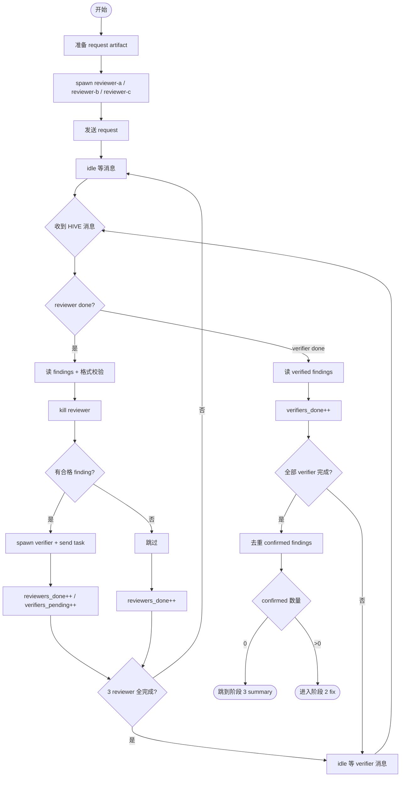

# 阶段 1: 审查 + 验证流水线 - Orchestrator

## 概述

Spawn 3 个 reviewer 并行审查。orch 发完 request 后 **idle 等消息**。每个 reviewer / verifier 完成后主动 `hive send orch` 通知，orch 被唤醒后处理并再次 idle。

**关键**：orch 不轮询。控制流由消息驱动。



## 准备

```bash
CTX_JSON=$(hive team)
WORKSPACE=$(printf '%s' "$CTX_JSON" | python3 -c 'import json,sys; print(json.load(sys.stdin).get("runtimeWorkspace",""))')
RUN_ID="$(date -u +%Y%m%dT%H%M%SZ)-$$"
RUN_NAME="cr-${RUN_ID}"
ARTIFACT_DIR="$WORKSPACE/artifacts/${RUN_NAME}"
STATE_DIR="$WORKSPACE/state/${RUN_NAME}"

mkdir -p "$ARTIFACT_DIR" "$STATE_DIR" "$WORKSPACE/events"

# 记录当前 review run 上下文（按实际情况替换）
printf '%s' 'pr' > "$STATE_DIR/review-mode"
printf '%s' '/absolute/path/to/repo' > "$STATE_DIR/review-repo-path"
printf '%s' 'PR #123' > "$STATE_DIR/review-subject"

# 生成 3 份 request artifact
for reviewer in reviewer-a reviewer-b reviewer-c; do
  out="$ARTIFACT_DIR/${reviewer}-r1.md"
  req="$ARTIFACT_DIR/${reviewer}-request.md"
  request_id="review-request-${reviewer}-r1"
  cat > "$req" <<EOF
Run Name: $RUN_NAME
Run Artifact Root: $ARTIFACT_DIR
Run State Root: $STATE_DIR
Mode: pr
Repo Path: /absolute/path/to/repo
Subject: PR #123
Diff Commands:
- git -C /absolute/path/to/repo fetch origin main
- git -C /absolute/path/to/repo diff origin/main...HEAD
Output Artifact: $out
Done Command: hive send orch "review done reviewer=${reviewer} verdict=<ok|issues> artifact=$out" --artifact $out
Validator Commands:
- PYTHONPATH=src python -m pytest tests/ -q
EOF
done
```

## Spawn reviewer

```bash
hive spawn reviewer-a --cli droid --model custom:Claude-Opus-4.6-0 --workflow code-review
hive spawn reviewer-b --cli droid --model custom:GPT-5.4-1 --workflow code-review
hive spawn reviewer-c --cli droid --model custom:Claude-Opus-4.6-0 --workflow code-review

hive layout main-vertical
```

## 发送 request

```bash
hive send reviewer-a "阶段 1 review：执行 request artifact $ARTIFACT_DIR/reviewer-a-request.md，完成时仅用其中的 Done Command 回传。"
hive send reviewer-b "阶段 1 review：执行 request artifact $ARTIFACT_DIR/reviewer-b-request.md，完成时仅用其中的 Done Command 回传。"
hive send reviewer-c "阶段 1 review：执行 request artifact $ARTIFACT_DIR/reviewer-c-request.md，完成时仅用其中的 Done Command 回传。"
```

发完后 **立即结束当前 response，什么都不做**。

**禁止**：
- 不要轮询 artifact 文件（禁止 glob/ls/sleep 循环）
- 不要轮询/等待状态
- 不要读取任何 artifact
- 不要写任何 python 脚本来检查文件
- 不要做 git diff / git show

你的 response 到这里结束。下一次 response 会由 reviewer 的 `hive send orch` 消息触发。

---

## 消息处理（收到 HIVE 消息后才执行以下内容）

orch 会收到形如以下的 `<HIVE>` 消息：

```
<HIVE from=reviewer-c to=orch artifact=/tmp/.../reviewer-c-r1.md>
review done reviewer=reviewer-c verdict=issues artifact=/tmp/.../reviewer-c-r1.md
</HIVE>
```

或来自 verifier：

```
<HIVE from=verifier-a to=orch artifact=/tmp/.../verifier-a-verify-result.md>
verify done verifier=verifier-a artifact=/tmp/.../verifier-a-verify-result.md
</HIVE>
```

### 从消息恢复当前 run 目录

```bash
CTX_JSON=$(hive team)
WORKSPACE=$(printf '%s' "$CTX_JSON" | python3 -c 'import json,sys; print(json.load(sys.stdin).get("runtimeWorkspace",""))')
ARTIFACT_PATH="/tmp/.../reviewer-c-r1.md"  # 用当前 HIVE 消息里的 artifact 路径替换
ARTIFACT_DIR=$(dirname "$ARTIFACT_PATH")
RUN_NAME=$(basename "$ARTIFACT_DIR")
STATE_DIR="$WORKSPACE/state/${RUN_NAME}"
```

### 收到 reviewer done 消息时

1. 读取其 artifact，丢弃缺少 File/Code/Verify 的 finding
2. 如果有 ≥1 条合格 finding：
   - 生成 verify task artifact
   - Kill 该 reviewer
   - Spawn verifier + send task
   - verifiers_pending++
3. 如果 0 条合格 finding：只 kill reviewer
4. reviewers_done++
5. 如果 reviewers_done < 3：idle 等下一条消息
6. 如果 reviewers_done == 3 且 verifiers_pending == 0：直接去收集（没有需要验证的）

### Spawn verifier 示例

```bash
cat > "$ARTIFACT_DIR/verifier-a-verify-task.md" <<EOF
# Verification Task
(reviewer-a 的合格 findings，包含 File/Code/Verify)
Run Name: $RUN_NAME
Run Artifact Root: $ARTIFACT_DIR
Run State Root: $STATE_DIR
Output Artifact: $ARTIFACT_DIR/verifier-a-verify-result.md
Done Command: hive send orch "verify done verifier=verifier-a artifact=$ARTIFACT_DIR/verifier-a-verify-result.md" --artifact $ARTIFACT_DIR/verifier-a-verify-result.md
EOF

hive kill reviewer-a
hive spawn verifier-a --cli droid --model custom:GPT-5.4-1 --workflow code-review
hive send verifier-a "evidence verification：执行 verify task $ARTIFACT_DIR/verifier-a-verify-task.md，完成时仅用其中的 Done Command 回传。"
```

### 收到 verifier done 消息时

1. 读取 verifier result artifact，收集 confirmed findings
2. Kill 该 verifier
3. verifiers_done++
4. 如果还有 verifier 在跑：idle 等下一条
5. 全部完成：去重 → 下一阶段

**注意**：reviewer 和 verifier 的消息可能交错到达。收到 verifier 消息时按 verifier 逻辑处理，收到 reviewer 消息时按 reviewer 逻辑处理。用 message 内容中的关键词（`review done` vs `verify done`）区分。

## 收集 + 去重

读取所有 verifier 的 result artifact，提取 `confirmed` 的 findings。多个 reviewer 报了同一问题的，合并为一条。

```bash
cat > "$ARTIFACT_DIR/confirmed-findings.md" <<EOF
# Confirmed Findings
(去重后的 confirmed findings)
EOF

printf '%s' '<confirmed 数量>' > "$STATE_DIR/confirmed-count"
```

## 分支

- confirmed = 0 → 跳到阶段 3（summary）
- confirmed > 0 → 进入阶段 2（fix）

## Decision Boundaries

Agent 自主完成（不问人）：

- review 策略选择（文件顺序、深度）
- finding 过滤/去重/合并
- verify fail 后自动进入下一轮 fix
- retry 失败的 tool call
- confirmed findings 为 0 时直接出 summary
- fix 超 3 轮仍 fail 时自主终止并在 summary 标注
- reviewer 超时无响应时 kill + 重 spawn

必须升级给人类：

- gh pr comment（对外可见）
- push 代码
- 跳过 fix 阶段
- 覆盖已 confirm 的 finding
- review 范围超出原始 diff
