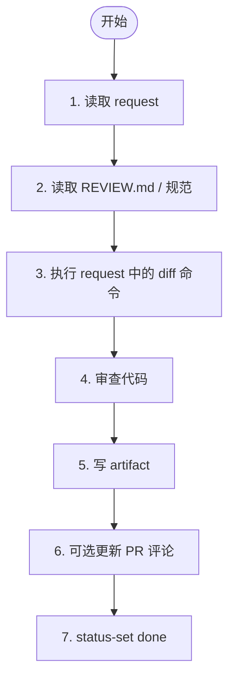

# 阶段 1: 代码审查 - Opus

审查 request 指定的变更，输出 artifact，并用 `hive status-set` 回传给 Orchestrator。

收到阶段 1 的 Hive 消息后，不要先回复泛化的 ready / 自我介绍。第一动作必须是：读取本文件、读取 request artifact、设置 busy 状态并开始执行审查。除非 request 无效，否则不要先发送任何只表示“已准备好”的 Hive 消息。



## 1. 读取 request

读取 orchestrator 指定的 request artifact。若缺少以下任一字段，立即失败回传：

- Mode
- Repo Path
- Subject
- Diff Commands
- Output Artifact
- Done Command

失败示例：

```bash
hive status-set failed "invalid request" --task code-review --meta stage=s1 --meta reviewer=opus
```

## 2. 读取 REVIEW.md / 规范

若 `Repo Path/REVIEW.md` 存在，先读它；若不存在，直接按变更审查。

## 3. 获取 diff

只执行 request 里明确列出的 diff 命令。

## 4. 审查代码

### How Many Findings to Return

Output all findings that the original author would fix if they knew about it. If there is no finding that a person would definitely love to see and fix, prefer outputting no findings. Do not stop at the first qualifying finding.

### Bug Detection Guidelines

Only flag an issue as a bug if:

1. It meaningfully impacts correctness, performance, security, or maintainability
2. It is discrete and actionable
3. It was introduced by the reviewed change, not pre-existing
4. It does not rely on unstated assumptions
5. The author would likely fix it if made aware

### Priority Levels

- 🔴 [P0] Blocking
- 🟠 [P1] Urgent
- 🟡 [P2] Normal
- 🟢 [P3] Low

## 5. 写 artifact

输出 artifact 模板：

```markdown
# Opus Review

## Summary
- Mode:
- Subject:
- Scope:

## Findings
1. [P?] 标题
   - File:
   - Why:
   - Evidence:

## Risks

## Follow-up

## Conclusion
✅ No issues found / Highest priority: P?
```

## 6. 可选 PR 评论

仅在 `Mode: pr` 且 `gh` 可用时，允许发布/更新人类可见评论。推荐 marker：

```markdown
<!-- hive-review-opus-r1 -->
## Opus Review
```

评论是 UI，artifact 才是最终判定依据。

## 7. 通知 Orchestrator

用 request 里的 Done Command 回传；至少带上：

- `stage=s1`
- `reviewer=opus`
- `artifact=<artifact path>`
- `verdict=ok|issues`

Done Command 已包含全部信号，一条即可。
