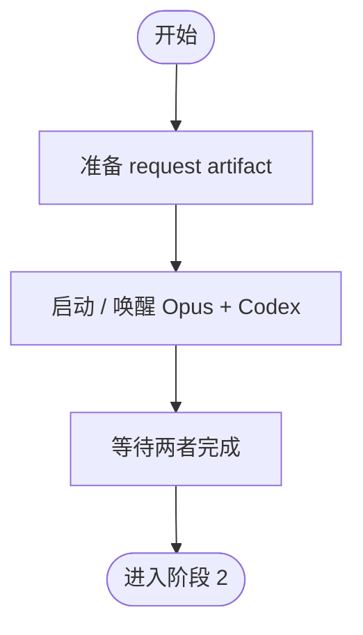

# 阶段 1: 并行代码审查 - Orchestrator

## 概述

启动 Opus 和 Codex 并行审查同一组变更。



## 任务

1. 解析 workspace 与 review 上下文
2. 为 Opus / Codex 生成独立 request artifact
3. 启动或唤醒两个 reviewer
4. 等待两者以 `stage=s1` 完成

## 执行

```bash
CTX_JSON=$(hive current)
WORKSPACE=$(printf '%s' "$CTX_JSON" | python3 -c 'import json,sys; print(json.load(sys.stdin).get("workspace",""))')

mkdir -p "$WORKSPACE/artifacts" "$WORKSPACE/state"

printf '%s' 'pr' > "$WORKSPACE/state/review-mode"
printf '%s' '/absolute/path/to/repo' > "$WORKSPACE/state/review-repo-path"
printf '%s' 'PR #123' > "$WORKSPACE/state/review-subject"
printf '%s' 'main' > "$WORKSPACE/state/review-base"
printf '%s' 'feature-branch' > "$WORKSPACE/state/review-branch"
printf '%s' '123' > "$WORKSPACE/state/review-pr"

for reviewer in opus codex; do
  out="$WORKSPACE/artifacts/${reviewer}-r1.md"
  req="$WORKSPACE/artifacts/${reviewer}-request.md"
  cat > "$req" <<EOF
Mode: pr
Repo Path: /absolute/path/to/repo
Subject: PR #123
Diff Commands:
- git -C /absolute/path/to/repo fetch origin main
- git -C /absolute/path/to/repo diff origin/main...HEAD
Output Artifact: $out
Done Command: hive status-set done "review complete" --task code-review --meta stage=s1 --meta reviewer=${reviewer} --meta artifact=$out --meta verdict=<ok|issues>
Validator Commands:
- PYTHONPATH=src python -m pytest tests/ -q
EOF
done

hive status-set busy --task code-review --activity launch-reviews

hive spawn opus --cli droid --model custom:Claude-Opus-4.6-0 --workflow code-review
hive spawn codex --cli droid --model custom:GPT-5.4-1 --workflow code-review

# 确认 reviewer 已加入 team；若缺失，先用更长 timeout 重试对应的 spawn
hive team

hive send opus "阶段 1（立即开始，不要回复 ready）：先读取 ~/.factory/skills/code-review/stages/1-review-opus.md，再立即读取并执行 request artifact：$WORKSPACE/artifacts/opus-request.md。不要只回复“ready”或自我介绍；完成时仅用 Done Command 回传。"
hive send codex "阶段 1（立即开始，不要回复 ready）：先读取 ~/.factory/skills/code-review/stages/1-review-codex.md，再立即读取并执行 request artifact：$WORKSPACE/artifacts/codex-request.md。不要只回复“ready”或自我介绍；完成时仅用 Done Command 回传。"
```

执行 `hive spawn` 时若外层工具支持 timeout，给至少 90s；若超时，不要直接假设失败，先用 `hive team` 确认 `opus` / `codex` 是否已加入。

如果 `hive spawn` 超时或被中断，但 `hive team` 已能看到 reviewer，**仅凭 team 成员列表不能确认 reviewer 已就绪**（`Agent.spawn()` 在 ready 检测超时后仍会注册 pane）。必须额外用 `hive capture <reviewer> --lines 10` 检查 pane 输出是否包含 agent CLI 的 ready 标志（如 `for help`），确认 reviewer 确实启动成功后，再执行：

```bash
hive workflow load opus code-review
hive workflow load codex code-review
```

然后再发送 request artifact；不要重复 spawn 同一个 reviewer。若 capture 显示 reviewer 未启动成功，杀掉对应 pane 并重新 spawn。

若 reviewer 只回复了泛化的 ready / 自我介绍，而没有进入 `stage=s1` 审查，不要继续空等；立刻重发一条更明确的执行指令，明确要求“立即开始阶段 1、不要回复 ready、完成时只用 Done Command 回传”。

## 等待

```bash
hive wait-status opus --state done --meta stage=s1 --meta reviewer=opus --timeout 1800
hive wait-status codex --state done --meta stage=s1 --meta reviewer=codex --timeout 1800
```

两个 reviewer 都完成后，进入阶段 2。
