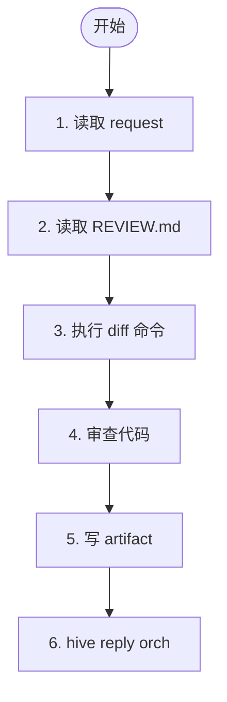

# 阶段 1: 代码审查 - Reviewer

独立审查 request 指定的变更，输出带 evidence 的 findings。

收到阶段 1 消息后，不要先回复泛化的 ready / 自我介绍。第一动作必须是：读取 request artifact 并开始执行审查。



## 1. 读取 request

读取 orchestrator 指定的 request artifact。若缺少以下任一字段，立即用 Done Command 回传失败：

- Mode
- Repo Path
- Subject
- Diff Commands
- Output Artifact
- Done Command

失败示例：

```bash
hive reply orch "review done reviewer=<自己的名字> verdict=error artifact=none"
```

## 2. 读取 REVIEW.md

若 `Repo Path/REVIEW.md` 存在，先读它；若不存在，直接按变更审查。

## 3. 获取 diff

只执行 request 里明确列出的 diff 命令。

## 4. 审查代码

### 报多少问题

输出所有"作者知道后大概率会修"的问题。没有这样的问题时，给出 `No issues found`。不要在发现第一个问题后就停止。

### Bug 检测标准

只有同时满足以下全部条件时才报 bug：

1. 对正确性、性能、安全或可维护性有实际影响
2. 离散且可操作
3. 由本次变更引入，不是既有问题
4. 不依赖未声明的假设
5. 作者知道后大概率会修

### 优先级

- 🔴 [P0] Blocking
- 🟠 [P1] Urgent
- 🟡 [P2] Normal
- 🟢 [P3] Low

## 5. 写 artifact

**每个 finding 必须包含 evidence。缺少 File / Code / Verify 任一项的 finding 会被丢弃。**

输出 artifact 模板：

```markdown
# <Reviewer Name> Review

## Summary
- Mode:
- Subject:
- Scope:

## Findings

1. [P?] 标题
   - File: path/to/file.py:42
   - Code: `从 diff 或文件中原文引用的代码片段`
   - Why: 为什么这是问题
   - Verify: `grep -n "pattern" path/to/file.py` 或可执行的 test 命令

2. [P?] 标题
   - File: path/to/other.py:10-15
   - Code: `原文引用`
   - Why: 原因
   - Verify: `PYTHONPATH=src python -m pytest tests/test_foo.py -k test_bar`

## Conclusion
✅ No issues found / Highest priority: P?
```

### Evidence 要求

- **File**: 必须是具体文件路径加行号（`path/to/file.py:42` 或 `path/to/file.py:10-15`）
- **Code**: 必须是从 diff 或源文件中原文复制的代码片段，不是你的复述或改写
- **Verify**: 必须是一条可直接在 shell 中执行的命令，用于验证问题确实存在

## 6. 通知 Orchestrator

用 request 里的 Done Command 回传。这条消息会直接发送到 orch 的 pane：

```bash
hive reply orch "review done reviewer=<自己的名字> verdict=<ok|issues> artifact=<artifact path>" --artifact <artifact path>
```

**只发这一条，不要发其他消息。**
