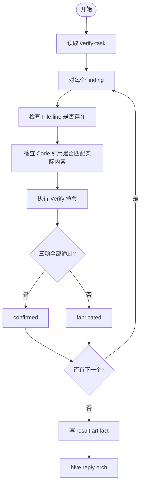

# 阶段 1: Evidence 验证 - Verifier

对分配到的 findings 逐项验证 evidence 是否真实。

收到任务后不要回复 ready。第一动作：读取 verify-task artifact → 开始验证。



## 验证步骤

对每个分配的 finding，依次执行：

### 1. 检查文件和行号

```bash
sed -n '42p' path/to/file.py
```

若文件不存在或行号超出范围 → `fabricated`

### 2. 检查代码引用

将 finding 中的 `Code` 字段与文件实际内容对比。引用必须是原文，不是改写或概括。

```bash
grep -F 'code snippet from finding' path/to/file.py
```

若代码引用与实际内容不匹配 → `fabricated`

### 3. 执行验证命令

运行 finding 中的 `Verify` 命令，检查输出是否支持该问题的存在。

若命令执行失败或输出不支持问题描述 → `fabricated`

## 输出 artifact

```markdown
# Verification Result

## F1: [C1] 标题
- Status: confirmed
- File check: path/to/file.py:42 存在 ✓
- Code check: 引用匹配 ✓
- Verify check: `grep -n ...` 输出匹配 ✓

## F2: [C3] 标题
- Status: fabricated
- File check: path/to/other.py:99 不存在 ✗
- Reason: 文件只有 50 行
```

## 回传

用 task 中的 Done Command 通知 orchestrator：

```bash
hive reply orch "verify done verifier=<自己的名字> artifact=<result artifact path>" --artifact <result artifact path>
```

**只发这一条，不要发其他消息。**
