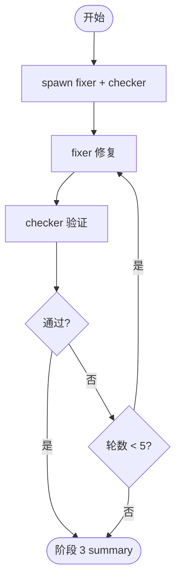

# 阶段 2: 修复验证 - Orchestrator

## 概述

Spawn 1 个 fixer + 1 个 checker 修复 confirmed findings。



## Spawn

```bash
hive status-set busy --task code-review --activity launch-fix-verify

hive spawn fixer --cli droid --model custom:Claude-Opus-4.6-0 --workflow code-review
hive spawn checker --cli droid --model custom:GPT-5.4-1 --workflow code-review

hive layout main-vertical
hive team
```

## 修复-验证循环

### 发送修复任务

```bash
ROUND=1
printf '%s' "$ROUND" > "$WORKSPACE/state/s2-round"

cat > "$WORKSPACE/artifacts/s2-fix-task.md" <<EOF
# Fix Task (Round $ROUND)

修复以下 confirmed findings：
(粘贴 $WORKSPACE/artifacts/confirmed-findings.md 内容)

Validator Commands:
(从 request artifact 中的 Validator Commands)

Output Artifact: $WORKSPACE/artifacts/s2-fix-round-${ROUND}.md
Done Command: hive status-set done "fix complete" --task code-review --meta stage=s2 --meta role=fix --meta round=$ROUND --meta artifact=$WORKSPACE/artifacts/s2-fix-round-${ROUND}.md
EOF

hive send fixer "阶段 2 fix：执行 fix task $WORKSPACE/artifacts/s2-fix-task.md，完成时仅用其中的 Done Command 回传。"
```

### 等待修复完成

```bash
hive wait-status fixer --state done --meta stage=s2 --meta role=fix --meta round=$ROUND --timeout 3600
```

### 发送验证任务

```bash
cat > "$WORKSPACE/artifacts/s2-verify-task.md" <<EOF
# Verify Task (Round $ROUND)

验证 fixer 的修复是否解决了全部 confirmed findings。

Fix Artifact: $WORKSPACE/artifacts/s2-fix-round-${ROUND}.md
Confirmed Findings: $WORKSPACE/artifacts/confirmed-findings.md

Output Artifact: $WORKSPACE/artifacts/s2-verify-round-${ROUND}.md
Done Command: hive status-set done "verify complete" --task code-review --meta stage=s2 --meta role=verify --meta round=$ROUND --meta result=<pass|fail> --meta artifact=$WORKSPACE/artifacts/s2-verify-round-${ROUND}.md
EOF

hive send checker "阶段 2 verify：执行 verify task $WORKSPACE/artifacts/s2-verify-task.md，完成时仅用其中的 Done Command 回传。"
```

### 等待验证完成

```bash
hive wait-status checker --state done --meta stage=s2 --meta role=verify --meta round=$ROUND --timeout 3600
```

### 处理结果

- `result=pass` → kill fixer + checker → 进入阶段 3
- `result=fail` 且 round < 5 → round++，重新发送修复任务
- `result=fail` 且 round >= 5 → kill fixer + checker → 进入阶段 3（标记修复未完成）

### 清理

```bash
hive kill fixer
hive kill checker
```
