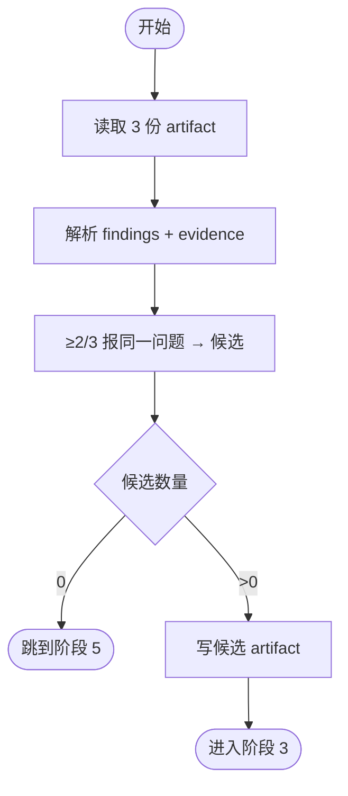

# 阶段 2: 投票合并 - Orchestrator

## 概述

读取 3 份 reviewer artifact，通过 ≥2/3 投票过滤出候选 findings。



## 执行

```bash
CTX_JSON=$(hive current)
WORKSPACE=$(printf '%s' "$CTX_JSON" | python3 -c 'import json,sys; print(json.load(sys.stdin).get("workspace",""))')

hive status-set busy --task code-review --activity merge-votes
```

## 合并规则

1. 读取 `$WORKSPACE/artifacts/reviewer-a-r1.md`、`reviewer-b-r1.md`、`reviewer-c-r1.md`
2. **丢弃不合格 finding**：缺少 File / Code / Verify 任一项的 finding 直接丢弃
3. **分组**：将三份 artifact 中的 findings 按语义相似度分组（同一文件同一位置同一类问题视为同一个 finding）
4. **投票**：≥2/3 的 reviewer 报了同一个 finding → 进入候选列表
5. 只有 1 个 reviewer 报的孤立 finding → 丢弃

## 输出

将候选 findings 写入 `$WORKSPACE/artifacts/s2-candidates.md`：

```markdown
# Candidate Findings

## C1: [P?] 标题
- File: path/to/file.py:42
- Code: `原文引用`（取最准确的一份）
- Why: 合并后的原因描述
- Verify: `验证命令`
- Reporters: reviewer-a, reviewer-c

## C2: [P?] 标题
...
```

记录结果：

```bash
printf '%s' '<候选数量>' > "$WORKSPACE/state/s2-candidate-count"
```

## 分支

- 候选数量 = 0 → 直接跳到阶段 5
- 候选数量 > 0 → 进入阶段 3
