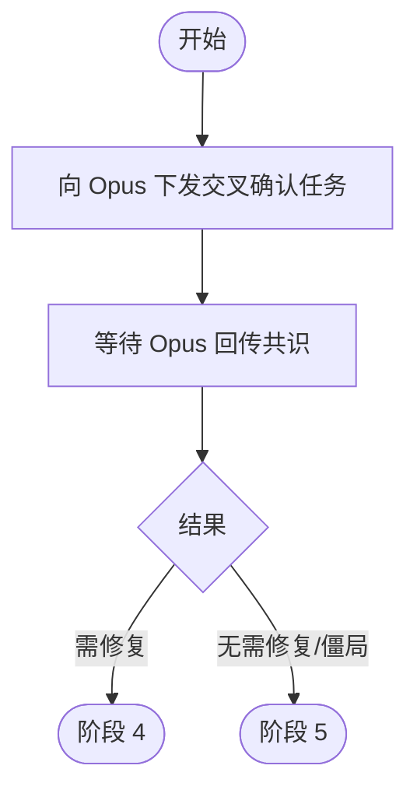

# 阶段 3: 交叉确认 - Orchestrator

## 概述

当两位 reviewer 结论有分歧时，启动交叉确认，让 Opus 与 Codex 直接对话达成共识。



## 执行

```bash
CTX_JSON=$(hive current)
WORKSPACE=$(printf '%s' "$CTX_JSON" | python3 -c 'import json,sys; print(json.load(sys.stdin).get("workspace",""))')
INPUT_ARTIFACT="$WORKSPACE/artifacts/s3-input.md"

cat > "$INPUT_ARTIFACT" <<EOF
# Cross Confirm Input

## Opus Findings
(粘贴或概括 $WORKSPACE/artifacts/opus-r1.md)

## Codex Findings
(粘贴或概括 $WORKSPACE/artifacts/codex-r1.md)
EOF

hive status-set busy --task code-review --activity launch-cross-confirm
hive send opus "阶段 3：读取 ~/.factory/skills/code-review/stages/3-cross-confirm-opus.md，并基于 $INPUT_ARTIFACT 与 Codex 达成共识。完成后用 status-set done 回传，带上 --meta stage=s3 --meta artifact=<consensus-artifact> --meta result=<fix|skip|deadlock>"
```

## 等待

```bash
hive wait-status opus --state done --meta stage=s3 --timeout 1800
```

收到结果后：

- `result=fix` → 阶段 4
- `result=skip` / `result=deadlock` → 阶段 5
