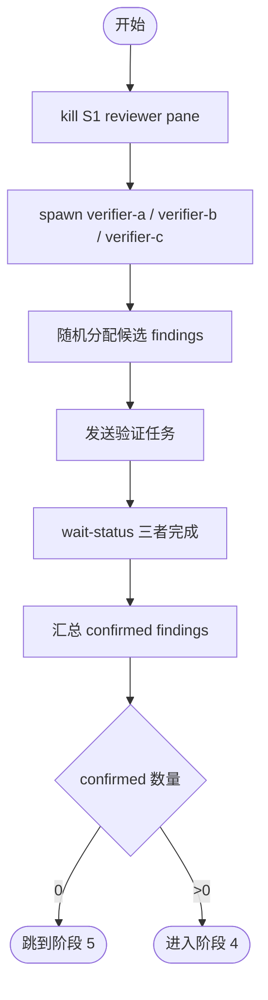

# 阶段 3: 分发验证任务 - Orchestrator

## 概述

Kill 阶段 1 的 reviewer，spawn 新的 verifier 并行验证候选 findings 的 evidence。



## Kill 旧 reviewer

```bash
tmux kill-pane -t <reviewer-a-pane-id>
tmux kill-pane -t <reviewer-b-pane-id>
tmux kill-pane -t <reviewer-c-pane-id>
```

用 `hive team` 查看各 reviewer 的 pane id。

## Spawn 新 verifier

```bash
hive status-set busy --task code-review --activity launch-verifiers

hive spawn verifier-a --cli droid --model custom:Claude-Opus-4.6-0 --workflow code-review
hive spawn verifier-b --cli droid --model custom:GPT-5.4-1 --workflow code-review
hive spawn verifier-c --cli droid --model custom:Claude-Opus-4.6-0 --workflow code-review

hive layout main-vertical
hive team
```

## 分配候选

将 `$WORKSPACE/artifacts/s2-candidates.md` 中的候选 findings **随机**分配给 3 个 verifier。为每个 verifier 生成独立的验证任务 artifact：

```bash
for v in verifier-a verifier-b verifier-c; do
  cat > "$WORKSPACE/artifacts/${v}-verify-task.md" <<EOF
# Verification Task

验证以下 findings 的 evidence 是否真实。

## 分配的 Findings
(此 verifier 负责的候选 finding 列表，包含 File/Code/Verify)

## 输出要求
对每个 finding 输出 confirmed 或 fabricated：
- confirmed: File:line 存在、Code 引用匹配实际内容、Verify 命令的结果支持该问题
- fabricated: 以上任一项不成立

Output Artifact: $WORKSPACE/artifacts/${v}-verify-result.md
Done Command: hive status-set done "verify complete" --task code-review --meta stage=s3 --meta verifier=${v} --meta artifact=$WORKSPACE/artifacts/${v}-verify-result.md
EOF
done
```

## 发送

```bash
hive send verifier-a "阶段 3：读取 ~/.factory/skills/code-review/stages/3-verify-verifier.md，再执行 $WORKSPACE/artifacts/verifier-a-verify-task.md。完成时仅用 Done Command 回传。"
hive send verifier-b "阶段 3：读取 ~/.factory/skills/code-review/stages/3-verify-verifier.md，再执行 $WORKSPACE/artifacts/verifier-b-verify-task.md。完成时仅用 Done Command 回传。"
hive send verifier-c "阶段 3：读取 ~/.factory/skills/code-review/stages/3-verify-verifier.md，再执行 $WORKSPACE/artifacts/verifier-c-verify-task.md。完成时仅用 Done Command 回传。"
```

## 等待

```bash
hive wait-status verifier-a --state done --meta stage=s3 --timeout 1800
hive wait-status verifier-b --state done --meta stage=s3 --timeout 1800
hive wait-status verifier-c --state done --meta stage=s3 --timeout 1800
```

## 汇总

读取 3 份 verify-result artifact，提取所有 `confirmed` 的 findings，写入：

```bash
cat > "$WORKSPACE/artifacts/s3-confirmed.md" <<EOF
# Confirmed Findings
(只包含被验证为 confirmed 的 findings)
EOF

printf '%s' '<confirmed 数量>' > "$WORKSPACE/state/s3-confirmed-count"
```

- confirmed 数量 = 0 → 跳到阶段 5
- confirmed 数量 > 0 → 进入阶段 4
