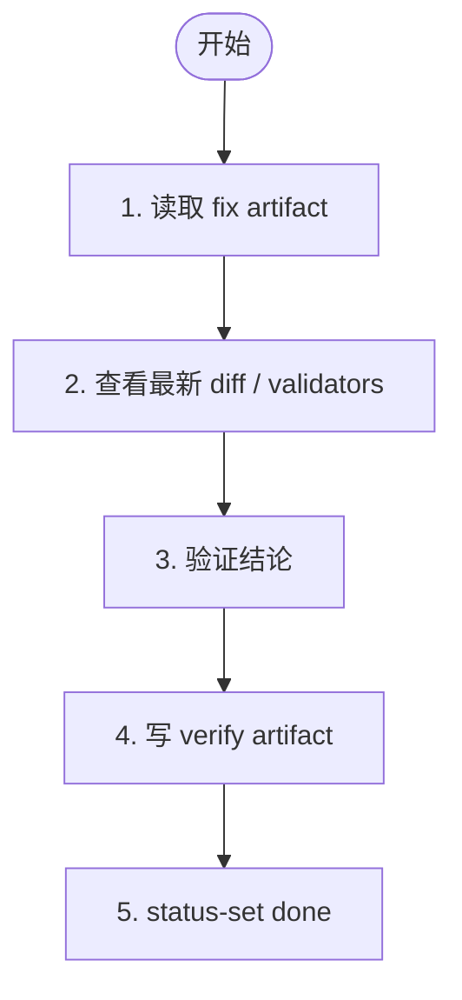

# 阶段 4: 验证 - Codex

验证 Opus 的修复是否解决了确认问题，且没有引入新的明显问题。



## 检查点

- 问题是否真正解决
- validator 结果是否可信
- 是否引入新的明显问题
- 是否还有未完成的 fix item

## 输出 artifact 模板

```markdown
# Verify Round N

## Verdict
pass / fail

## Notes
- ...
```

## 回传

```bash
hive status-set done "verify round complete"           --task code-review           --meta stage=s4           --meta role=verify           --meta round=<n>           --meta result=<pass|fail>           --meta artifact=/tmp/hive-xxx/artifacts/s4-verify-round-<n>.md
```
