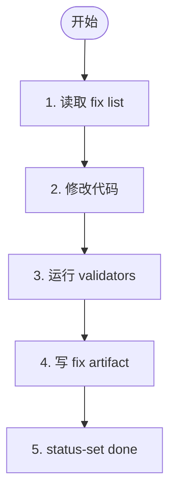

# 阶段 4: 修复 - Opus

根据共识 artifact 修复已确认的问题，并运行 request 中约定的 validators。



## 规则

- 只修复共识中标记为 `Fix` 的问题
- 尽量保持改动最小、聚焦
- 必须运行相关 validators，并在 artifact 里记录命令与结果
- 若无法完整修复，明确写出残留项

## 输出 artifact 模板

```markdown
# Fix Round N

## Fixed
- C1: ...

## Validators
- command: ...
- result: pass/fail

## Remaining
- ...
```

## 回传

```bash
hive status-set done "fix round complete"           --task code-review           --meta stage=s4           --meta role=fix           --meta round=<n>           --meta artifact=/tmp/hive-xxx/artifacts/s4-fix-round-<n>.md
```
