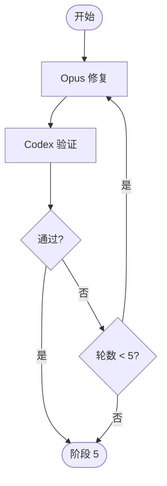

# 阶段 4: 修复验证 - Orchestrator

## 概述

协调 Opus 修复、Codex 验证，最多 5 轮。



## 执行

```bash
CTX_JSON=$(hive current)
WORKSPACE=$(printf '%s' "$CTX_JSON" | python3 -c 'import json,sys; print(json.load(sys.stdin).get("workspace",""))')

printf '%s' '1' > "$WORKSPACE/state/s4-round"
hive status-set busy --task code-review --activity fix-verify-round-1

hive send opus "阶段 4：读取 ~/.factory/skills/code-review/stages/4-fix-verify-opus.md，按共识 artifact 修复问题。完成后用 --meta stage=s4 --meta role=fix --meta round=1 回传。"
```

## 等待与推进

```bash
hive wait-status opus --state done --meta stage=s4 --meta role=fix --meta round=1 --timeout 3600
hive send codex "阶段 4：读取 ~/.factory/skills/code-review/stages/4-fix-verify-codex.md，验证最新修复。完成后用 --meta stage=s4 --meta role=verify --meta round=1 --meta result=<pass|fail> 回传。"
hive wait-status codex --state done --meta stage=s4 --meta role=verify --meta round=1 --timeout 3600
```

处理结果：

- `result=pass` → 阶段 5
- `result=fail` 且轮数 < 5 → 递增 `s4-round`，继续下一轮
- `result=fail` 且轮数 >= 5 → 阶段 5（标记修复未完成）
