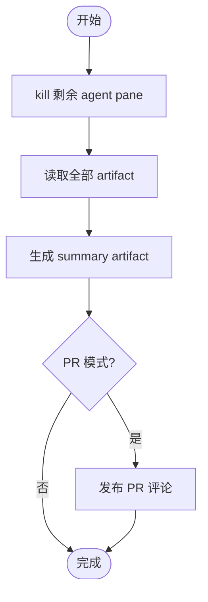

# 阶段 5: 汇总 - Orchestrator

## 概述

读取全部 artifact，生成最终 review summary。



## Kill 剩余 agent

```bash
# kill 当前阶段残留的 agent pane（fixer/checker 或 verifier）
# 用 hive team 查看 pane id，逐个 tmux kill-pane
```

## 汇总

读取：

- `reviewer-a-r1.md`, `reviewer-b-r1.md`, `reviewer-c-r1.md`（S1 原始审查）
- `s2-candidates.md`（S2 投票候选）
- `s3-confirmed.md`（S3 验证确认）
- `s4-fix-round-*.md` / `s4-verify-round-*.md`（若存在）

## 生成 summary artifact

```markdown
# Code Review Summary

## Timeline
- Stage 1: 3 reviewer 并行审查
- Stage 2: 投票合并 → N 个候选
- Stage 3: Evidence 验证 → M 个 confirmed
- Stage 4: 修复验证 → pass/fail/skipped

## Confirmed Findings
| # | 问题 | 状态 |
| - | ---- | ---- |
| C1 | ... | Fixed ✅ / Unfixed ❌ |

## Discarded (evidence fabricated)
| # | 问题 | 原因 |
| - | ---- | ---- |

## Reviewer Conclusions
- Reviewer A: ...
- Reviewer B: ...
- Reviewer C: ...

## Final Conclusion
✅ No issues found / ⚠️ Issues found and fixed / ❌ Issues remain unfixed
```

写入：

```bash
printf '%s' "$WORKSPACE/artifacts/review-summary.md" > "$WORKSPACE/state/review-summary-artifact"
```

## 可选 PR 评论

仅在 `Mode: pr` 且 `gh` 可用时：

```bash
gh pr comment <number> --body-file "$WORKSPACE/artifacts/review-summary.md"
```

## 完成

```bash
hive status-set done "review workflow complete" \
  --task code-review \
  --meta stage=s5 \
  --meta artifact=$WORKSPACE/artifacts/review-summary.md
```
