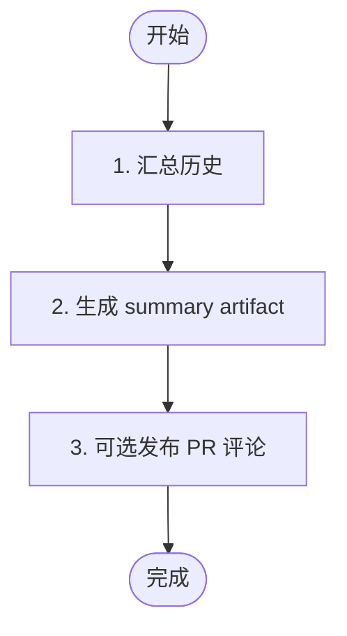

# 阶段 5: 汇总 - Orchestrator

## 概述

读取全部 artifact，生成最终总结，并在 PR 模式下可选发布一条人类可见评论。



## 1. 汇总历史

读取：

- `opus-r1.md`
- `codex-r1.md`
- `s3-consensus.md`（若存在）
- `s4-fix-round-*.md` / `s4-verify-round-*.md`（若存在）

此阶段可回看代码或 diff 来校准最终措辞；审查本身已在阶段 1-4 由 reviewer 完成。

## 2. 生成 summary artifact

模板：

```markdown
# Code Review Summary

## Timeline
- Stage 1: Opus / Codex 并行审查
- Stage 2: 共识判断 = ...
- Stage 3: 交叉确认 = ...
- Stage 4: 修复验证 = ...

## Findings
| # | 问题 | 状态 |
| - | ---- | ---- |

## Agent Conclusions
- Opus: ...
- Codex: ...

## Final Conclusion
✅ No issues found / ⚠️ Needs attention / ✅ Fixed after review
```

将 summary artifact 路径写入：

```bash
printf '%s' '/tmp/hive-xxx/artifacts/review-summary.md' > "$WORKSPACE/state/review-summary-artifact"
```

## 3. 可选发布 PR 评论

仅在 `Mode: pr` 且 `gh` 可用时，允许发布一条总结评论。推荐 marker：

```markdown
<!-- hive-review-summary -->
## Code Review Summary
```

示例：

```bash
gh pr comment <number> --body-file "$WORKSPACE/artifacts/review-summary.md"
```

## 4. 完成

```bash
hive status-set done "review workflow complete" \
  --task code-review \
  --meta stage=s5 \
  --meta artifact=/tmp/hive-xxx/artifacts/review-summary.md
```
